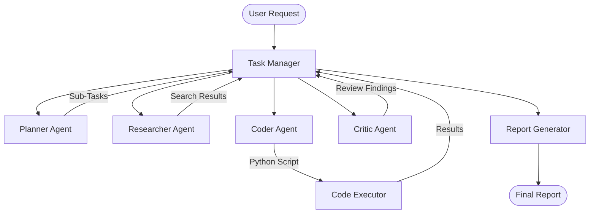

# Agent Architecture & Functionality

This document details the internal design of the **Autonomous AI Researcher** and how the different agents collaborate.

## 🏛️ System Overview

The system is built on a modular "Task-Actor" design, where an orchestration loop manages high-level goals and delegates specific sub-goals to specialized agents.

### 🧩 Interaction Flow

## 🤖 Agent Roles

### 1. Planner Agent (`planner.py`)
- **System Prompt**: Functions as a Senior Research Project Manager.
- **Input**: User's initial research question.
- **Functionality**: Decomposes the query into a structured roadmap (JSON format). It identifies which technical aspects require literature review and which require experimental validation.

### 2. Researcher Agent (`researcher.py`)
- **System Prompt**: Functions as an Academic Peer-Reviewer and Librarian.
- **Tools**: `arxiv_search`, `paper_parser`.
- **Functionality**: Extracts key findings, methodologies, and limitations from academic papers. It summarizes these findings to provide context for the Coder.

### 3. Coder Agent (`coder.py`)
- **System Prompt**: Functions as a Research Software Engineer.
- **Tools**: `code_executor`.
- **Functionality**: Generates autonomous Python scripts targeted at proving or disproving hypotheses. It focuses on clean, reproducible research code.

### 4. Critic Agent (`critic.py`)
- **System Prompt**: Functions as a Scientific Critic.
- **Functionality**: Evaluates whether the generated code results align with the initial research goal. It identifies biases, errors, and areas for further iteration.

## 🏗️ Core Infrastructure

### LLM Integration (`core/llm_client.py`)
Uses a unified wrapper to manage tokens, temperature, and structured output (JSON schema).

### Memory System (`memory/`)
Stores research history and search results in a searchable format to prevent redundant tasks and enable long-running research loops.

### Task Manager (`core/task_manager.py`)
Acts as the central state store, keeping track of what has been completed and what is pending.
